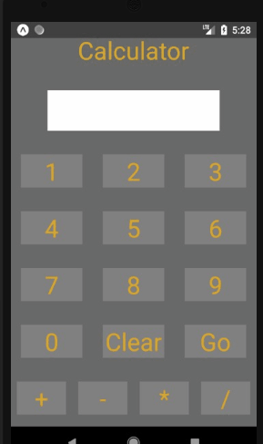

# Calculator

 

### Table of Contents
1. Demo Link
2. Purpose
3. Motivation
4. Objectives
5. Technologies Used

### Demo Link: [Calculator](https://snack.expo.io/@jcsmileyjr/calculator)

### Purpose:
A calculator app for the android mobile device

### Motivation:
I was inspired by a LinkedIn user who posted his calculator app. I used his design to practice with the React Native framework.

### Objectives:
* The user can do calculations with any two numbers and a operator.
* The user can clear the display screen
* The user can use the previous total as the first number in the calculation

### This app was built with the following technologies:
**React Native:** JavaScript mobile app framework 
 
**Git-Hub:** web-based version control repository and Internet hosting service
 
**Flexbox:** A CSS based layout technology for building responsive websites
  
**JavaScript:** object-oriented programming language for web pages
 
**HTML:** Mark-up language for creating web pages 
 
**CSS:** A formatting language for styling web pages
 
*Create by JC Smiley in February of 2019*